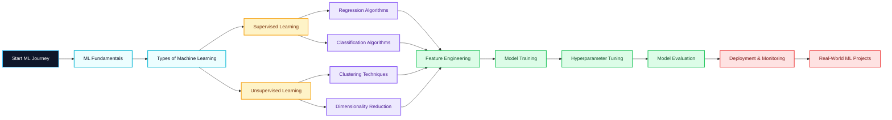

<!-- ================== MACHINE LEARNING NOTES REPOSITORY README ================== -->

  

<h1 align="center">🤖 Machine Learning Notes — Beginners to Advanced</h1>

A structured, concept-first and practice-driven repository for mastering  
<b>Machine Learning</b> from fundamentals to real-world deployment.

---

## 🔥 Repository Stats

<!-- Stars -->

<!-- Forks -->

<!-- Watchers -->

<!-- Downloads -->

---

## 🚀 What’s Inside?

| Level | Topics Covered |
|------|----------------|
| 🔹 Fundamentals | ML Overview, Types of ML, Use-Cases |
| 📊 Data Prep | Data Cleaning, EDA, Feature Engineering |
| 📐 Mathematics | Linear Algebra, Probability, Statistics |
| 🧠 Algorithms | Regression, Classification, Clustering |
| ⚙️ Model Tuning | Bias-Variance, Cross-Validation |
| 📈 Evaluation | Accuracy, Precision, Recall, F1, ROC |
| 🚀 Deployment | Pipelines, APIs, Model Serving |
| 📦 Libraries | NumPy, Pandas, Scikit-Learn, TensorFlow |

---
🧠 Why Learn Machine Learning?

✔ Powers modern AI systems

✔ High-demand career skill

✔ Used in finance, healthcare, marketing, IT
✔ Backbone of Data Science & AI

---
## 🎯 Objectives of This Repository

- Build **strong conceptual clarity** in Machine Learning  
- Understand **why & when** to use specific algorithms  
- Learn **end-to-end ML workflow** (data → model → deployment)  
- Bridge the gap between **theory and real-world implementation**  
- Prepare learners for **industry roles & interviews**

---

## 🌟 Importance of Machine Learning

- 🔹 Backbone of modern **AI & Data Science**
- 🔹 Powers systems like **recommendation engines, fraud detection, NLP**
- 🔹 Enables **data-driven decision making**
- 🔹 High-demand skill across industries (IT, Finance, Healthcare, Marketing)
- 🔹 Foundation for **Deep Learning & Generative AI**

---

## 📦 What This Repository Covers

| Level | Coverage |
|-----|---------|
| 🟢 Beginner | ML Basics, Types of ML, Terminology |
| 🟡 Intermediate | Data Preprocessing, Algorithms |
| 🔵 Advanced | Model Tuning, Evaluation, Deployment |
| 🔴 Industry | End-to-End Projects & Use-Cases |

---

## 🧭 Machine Learning Roadmap (UI/UX Styled Flow)

## 🧠 Key Concepts You Will Learn

🔹 Core Foundations
What is Machine Learning?

Types of ML (Supervised, Unsupervised, Semi-Supervised)

ML vs AI vs Deep Learning

🔹 Data Handling
   Data Cleaning

  Exploratory Data Analysis (EDA)

Feature Engineering & Scaling

🔹 Algorithms
   Linear & Logistic Regression

   Decision Trees

   KNN, Naive Bayes

Clustering (K-Means, Hierarchical)

🔹 Model Optimization
   Bias–Variance Tradeoff

   Cross Validation

   Hyperparameter Tuning

🔹 Evaluation Metrics
  Accuracy, Precision, Recall

  F1 Score

  ROC-AUC

  Confusion Matrix

🔹 Deployment
   Pipelines

   Model Serialization

   API & App Deployment
   
---

## 🛠️ Tools & Technologies Used
   
| Tool                 | Purpose             |
| -------------------- | ------------------- |
| Python               | Core Language       |
| NumPy                | Numerical Computing |
| Pandas               | Data Manipulation   |
| Matplotlib / Seaborn | Visualization       |
| Scikit-Learn         | Machine Learning    |
| TensorFlow / PyTorch | Deep Learning       |
| Streamlit / Flask    | Deployment          |

---
Below is a **step-by-step, fundamentals-to-foundation explanation of Machine Learning**, written in **clear, structured, exam + industry–oriented language**.
This is suitable for **students, beginners, faculty, and self-learners**.

---

# 🤖 Machine Learning Fundamentals — Step by Step (Detailed)

---

## **Step 1: What is Machine Learning?**

**Machine Learning (ML)** is a branch of Artificial Intelligence where a system **learns patterns from data** and makes decisions or predictions **without being explicitly programmed** for every scenario.

### In simple words:

> Instead of writing rules → we give **data + algorithm**, and the machine **learns rules by itself**.

### Example:

* Email spam filter
* Movie recommendations
* Credit card fraud detection

---

## **Step 2: Why Do We Need Machine Learning? (Importance)**

Traditional programming fails when:

* Rules are too complex
* Data is huge
* Patterns change over time

### Machine Learning helps to:

* ✔ Automate decision making
* ✔ Analyze large datasets
* ✔ Improve accuracy over time
* ✔ Predict future outcomes

### Real-world uses:

* Healthcare diagnosis
* Banking risk analysis
* Marketing personalization
* Self-driving cars

---

## **Step 3: Basic Terminologies (Very Important)**

| Term       | Meaning                      |
| ---------- | ---------------------------- |
| Dataset    | Collection of data           |
| Feature    | Input variable (independent) |
| Label      | Output variable (dependent)  |
| Model      | Learned pattern              |
| Algorithm  | Learning method              |
| Training   | Learning from data           |
| Testing    | Checking performance         |
| Prediction | Output from model            |

---

## **Step 4: Types of Machine Learning**

### **1️⃣ Supervised Learning**

* Data is **labeled**
* Input + Output known

**Examples:**

* Regression
* Classification

**Use cases:**

* Price prediction
* Email spam detection

---

### **2️⃣ Unsupervised Learning**

* Data is **unlabeled**
* Finds hidden patterns

**Examples:**

* Clustering
* Dimensionality reduction

**Use cases:**

* Customer segmentation
* Market basket analysis

---

### **3️⃣ Semi-Supervised Learning**

* Small labeled data + large unlabeled data
* Used when labeling is costly

---

### **4️⃣ Reinforcement Learning**

* Learns by **reward & penalty**
* No labeled data

**Use cases:**

* Robotics
* Game AI

---

## **Step 5: Machine Learning Workflow (Core Foundation)**

### ML always follows this sequence:

1️⃣ Problem definition
2️⃣ Data collection
3️⃣ Data preprocessing
4️⃣ Feature engineering
5️⃣ Model selection
6️⃣ Model training
7️⃣ Model evaluation
8️⃣ Model deployment

---

## **Step 6: Data Collection**

Data can be:

* CSV / Excel files
* Databases
* APIs
* Sensors
* Web scraping

### Quality data = Better model

---

## **Step 7: Data Preprocessing (Most Critical Step)**

Raw data is **never clean**.

### Tasks include:

* Handling missing values
* Removing duplicates
* Encoding categorical data
* Feature scaling (Normalization / Standardization)
* Removing outliers

> 🔑 **80% effort goes into data preparation**

---

## **Step 8: Exploratory Data Analysis (EDA)**

EDA helps understand data behavior.

### Includes:

* Mean, median, standard deviation
* Distribution analysis
* Correlation analysis
* Visualizations (histograms, box plots)

Purpose:

* Detect patterns
* Identify relationships
* Spot anomalies

---

## **Step 9: Feature Engineering**

Feature Engineering means **creating better input features**.

### Examples:

* Creating age group from age
* Extracting year from date
* Combining multiple columns

Good features = High accuracy

---

## **Step 10: Machine Learning Algorithms (Foundation Level)**

### 🔹 Regression Algorithms

Used when output is **continuous**.

Examples:

* Linear Regression
* Polynomial Regression

---

### 🔹 Classification Algorithms

Used when output is **categorical**.

Examples:

* Logistic Regression
* Decision Tree
* KNN
* Naive Bayes

---

### 🔹 Clustering Algorithms

Used in **unsupervised learning**.

Examples:

* K-Means
* Hierarchical Clustering

---

## **Step 11: Model Training**

Training means:

* Feeding data to algorithm
* Algorithm adjusts internal parameters
* Learns pattern from data

More data + good features = Better learning

---

## **Step 12: Model Evaluation**

We must check **how good the model is**.

### Common metrics:

* Accuracy
* Precision
* Recall
* F1-Score
* Confusion Matrix

Evaluation prevents **wrong predictions in real life**.

---

## **Step 13: Overfitting & Underfitting**

### Overfitting:

* Model learns noise
* High training accuracy, low test accuracy

### Underfitting:

* Model too simple
* Poor performance everywhere

### Solution:

* Cross-validation
* Regularization
* More data

---

## **Step 14: Hyperparameter Tuning**

Hyperparameters are **external settings** of algorithms.

Examples:

* Number of neighbors in KNN
* Depth of decision tree

Tuning improves performance.

---

## **Step 15: Model Deployment (Real-World Step)**

Deployment means:

* Using model in real applications

Examples:

* Web app
* API
* Mobile app

Tools:

* Flask
* FastAPI
* Streamlit

---

## **Step 16: Tools & Libraries (Fundamental Stack)**

| Tool                 | Purpose              |
| -------------------- | -------------------- |
| Python               | Programming          |
| NumPy                | Numerical operations |
| Pandas               | Data manipulation    |
| Matplotlib / Seaborn | Visualization        |
| Scikit-Learn         | ML algorithms        |

---

## **Step 17: Machine Learning vs AI vs Deep Learning**

| Concept       | Meaning            |
| ------------- | ------------------ |
| AI            | Broad intelligence |
| ML            | Learning from data |
| Deep Learning | Neural networks    |

ML is the **foundation** of modern AI.

---

## **Summary**

* Machine Learning learns from data
* Data quality matters most
* Algorithms are tools, not magic
* Understanding workflow is more important than memorizing formulas
* Fundamentals build strong advanced concepts

---

🧑‍💻 Author

Ashwin Ananta Panbude
Data Analyst | Faculty 

  
  
  

